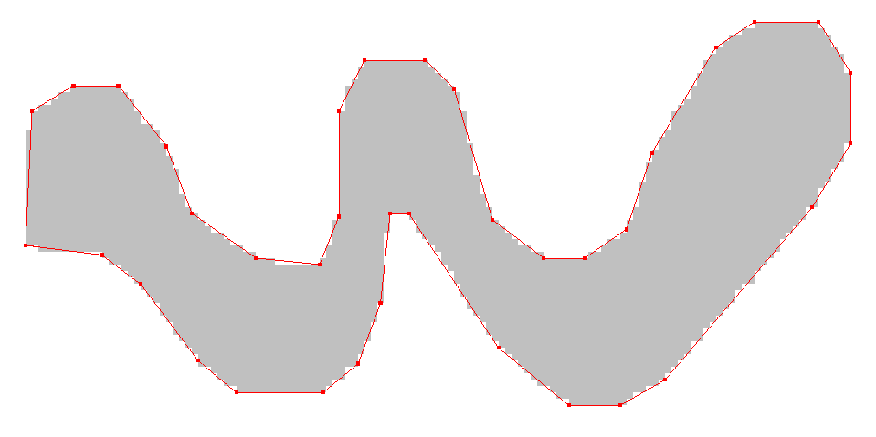
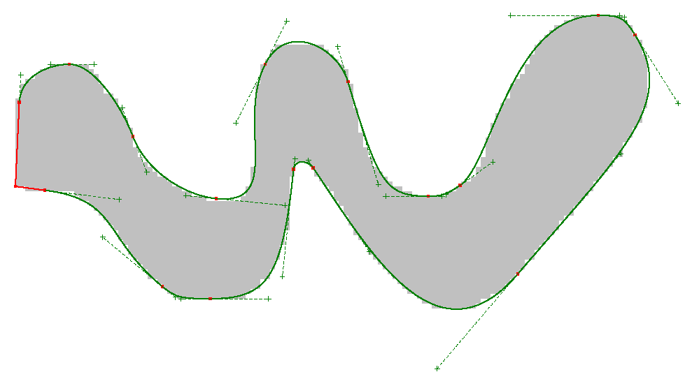
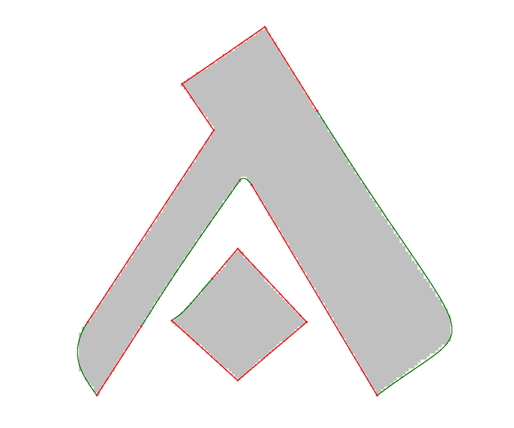
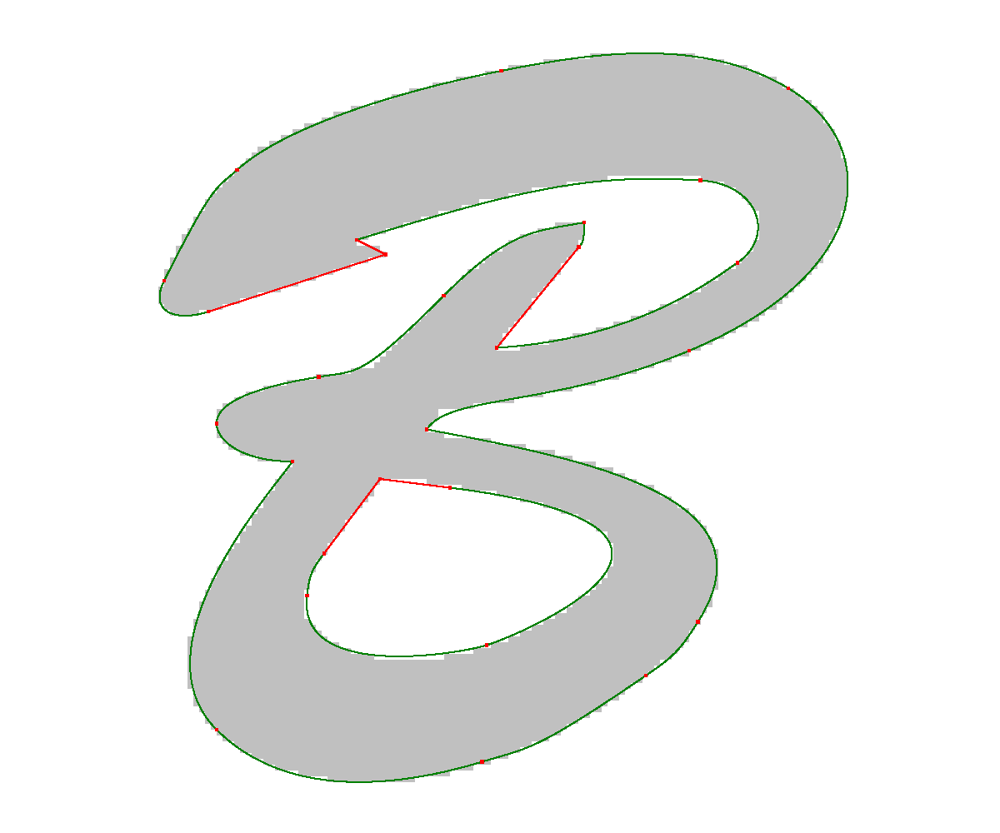
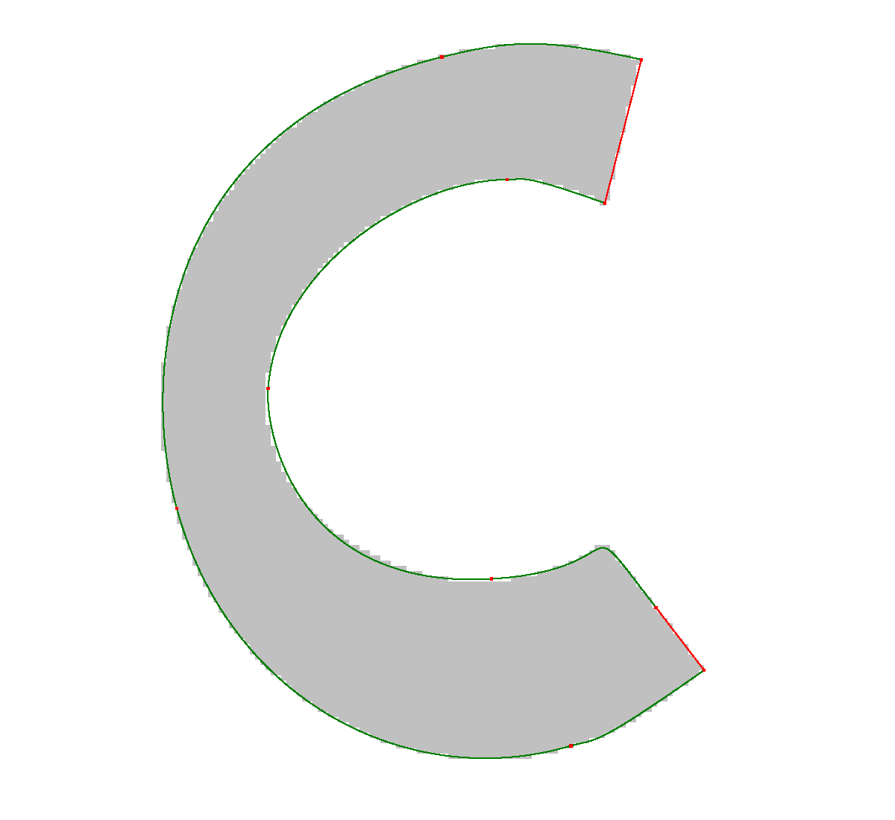
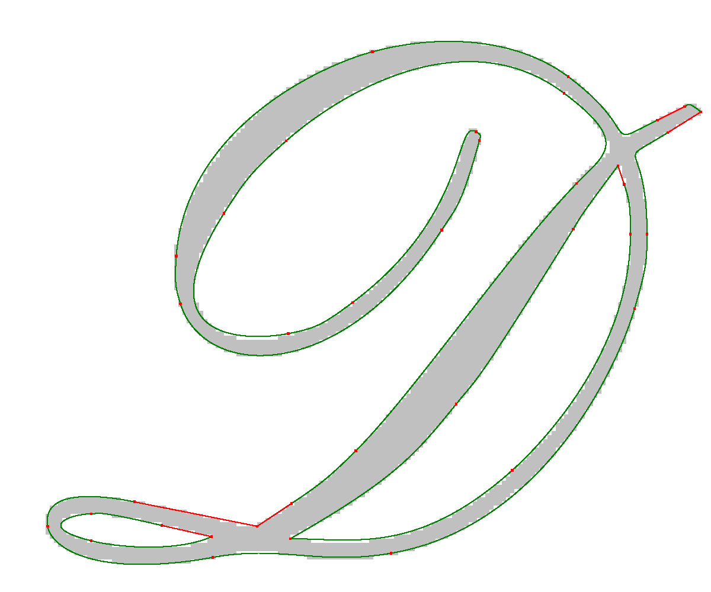
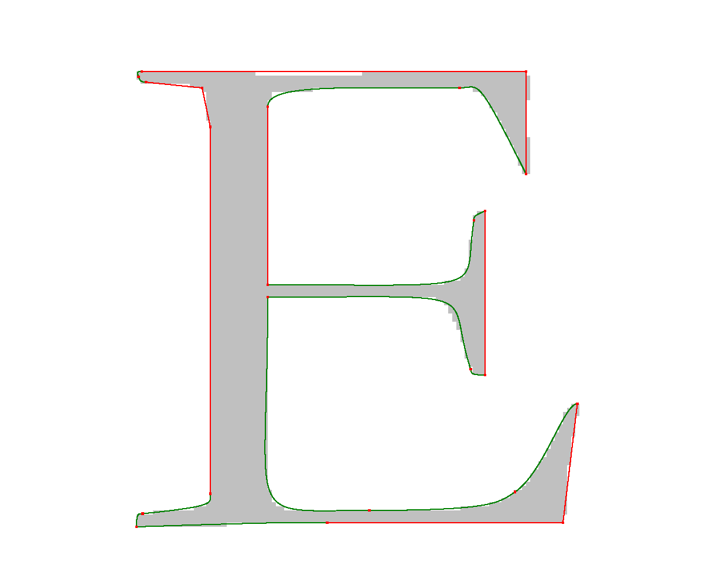
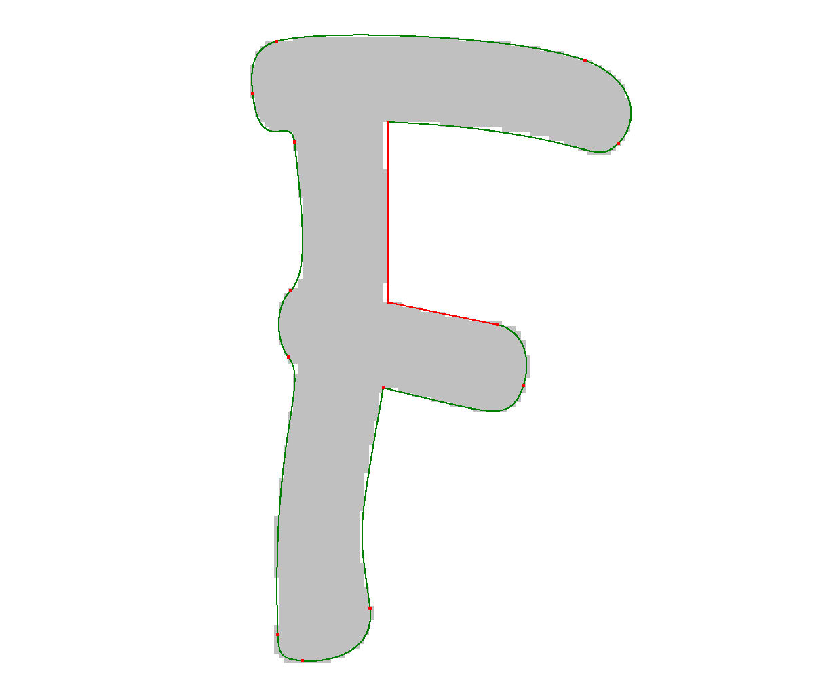

# Raster to Vector Conversion

This is an algorithm for raster to vector conversion which I developed in 2003.
It approximates the contour of a raster image by lines and Bézier curves
using heuristics, optimization and shortest path calculations.
The code is written in C++. Previous versions of it were written in
C and have been part of a graphics program called "Avant Vector" which I
developed for Atari ST and NeXT computers in the early 90'.
More details on the algorithm can be found in the paper [[1]](#1).

## Build

The source code can be built with any standard C++ compiler. Just invoke

```sh
make
```

For Windows a Visual Studio project file is included.

The code requires the [libpng](http://www.libpng.org/pub/png/libpng.html)
library as dependency. This must be installed beforehand.

## Run

The program expects a bi-level raster image in PNG format and outputs
a vector graphic in SVG format.

Below you find experimental results of the algorithm. They have been generated
by the commands:

```sh
cd experiments
spvec polygon.png polygon.1.svg svg_lines1=1
spvec polygon.png polygon.2.svg svg_curves=1 svg_control=1
spvec a.png a.svg svg_curves=1
spvec b.png b.svg svg_curves=1
spvec c.png c.svg svg_curves=1
spvec d.png d.svg svg_curves=1
spvec e.png e.svg svg_curves=1
spvec f.png f.svg svg_curves=1
```










## Parameters

Parameters can be specified on the command line or in a parameters file
`spvec.par`. Command line arguments take precedence over settings in the
parameters file.

```
// tracer parameters
tr_middle_points=1      // add nodes for points between pixel boundaries to the graph (0, 1)

// shortest path parameters
sp_depth_limit=500      // maximal number of nodes bridged by an edge in the graph (limit1)
sp_missed_limit=10      // stop search after this number of consecutive unfeasable edges (limit2)

// line parameters
l_max_distance=1        // maximal feasible distance between line segment and contour (maxdist1)
l_cost_segment=10       // cost per line segment (c1)
l_cost_distance=0       // cost for average distance between line segment and contour
l_cost_area=1           // cost for the area between line segment and contour

// Bézier curve parameters
b_fit_heuristic=1       // selection of the heuristic (currently always 1)
b_corner_angle=90       // points with angles less this value are marked as corners
b_max_distance=1.1      // maximal feasible distance between curve segment and contour (maxdist2)
b_cost_curve=10         // cost per curve segment (c3)
b_cost_area=1           // cost for the area between curve segment and contour
b_cost_segment=20       // cost per line segment (c2)

// SVG output parameters
svg_points=0            // output the traced points
svg_lines1=0            // output the line segments (phase 1)
svg_lines2=0            // output line segments with intermediate points (phase 2)
svg_curves=1            // output line segments and Bézier curve segments (phase 2)
svg_control=1           // output the control points for the Bézier curve segments
```

## References
<a id="1">[1]</a>
M. Böhm: <i><a href="https://s3.eu-central-1.amazonaws.com/max-boehm.de/pubs/ipsi2003.pdf">
Fast Raster to Vector Conversion based on Optimization and Heuristics</a></i>,
proc. International Conference on Advances in the Internet,
Processing, Systems, and Interdisciplinary Research, IPSI 2003, Sveti
Stefan, Montenegro, 2003.

<i><b>Abstract:</b>
This paper describes an algorithm for raster to vector conversion of bi-level
raster images. The contours of the image are approximated by line segments and
piecewise cubic Bézier curves. The objective is to find an accurate and smooth
representation of each contour consisting of as few as possible line and curve
segments. The algorithm first calculates a cost-optimal polygonal approximation
of the contour. In a second step, parts of this polygon are substituted by cubic
Bézier curves. The optimization problems are solved efficiently by shortest
path computations. By using heuristics, which restrict the solution space to an
"important" subset, very good solutions can be found in linear time.
Experimental results are given.</i>
